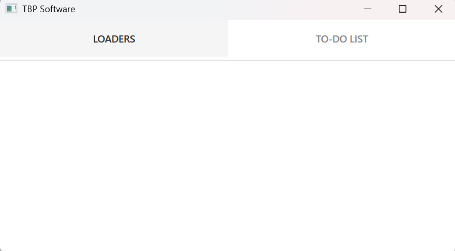
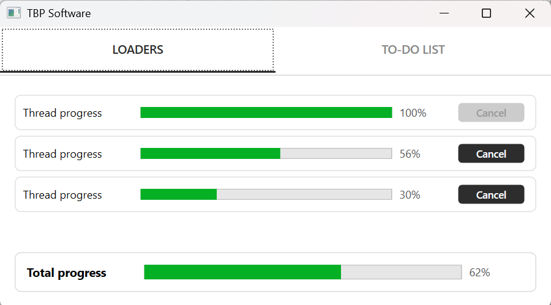
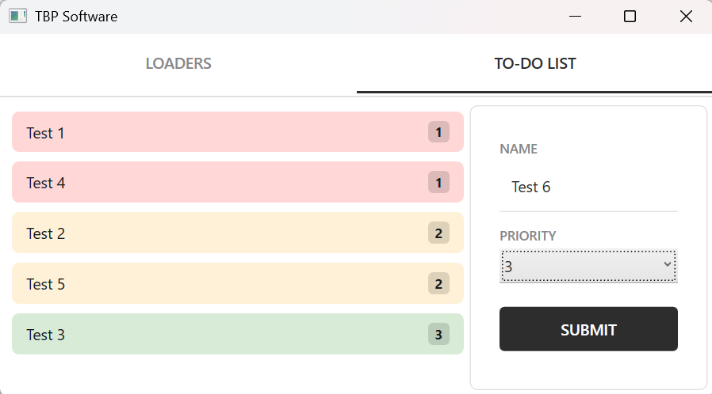

# Assignment
 
## Table of Contents
 
1. [Application Overview](#application-overview)
2. [Technical Implementation](#technical-implementation)
3. [Architecture](#architecture)
4. [Tests](#tests)
5. [CI](#ci)
6. [Running the Application](#running-the-application)
---
 
## Application Overview
 
The application has been visually improved compared to the skeleton — nav-bar buttons and action buttons within the Content container have been given a consistent style. The theme is light with dark accents that provide clean contrast throughout the application.
 
| Initial Screen | Loaders | ToDo List |
|---|---|---|
|  |  |  |
 
**Loaders** displays the progress of three parallel processes in real time with the ability to cancel each individually.
 
**ToDo** allows adding items that are automatically sorted by priority and visually distinguished by color.
 
---

 
## Technical Implementation
 
### Model
 
The skeleton project did not contain a Model layer. A `Model` folder was added with the following classes:
 
**`ThreadWorker`** — represents the state of a single background thread that must be displayed on the UI:
 
- `Duration` — random execution time (10–50 seconds), set during initialization
- `Elapsed` — elapsed time, updated every second
- `Progress` — computed property, calculated from `Elapsed / Duration`
- `CancellationTokenSource` — holds the token for stopping the thread
- `IsActive` — signals the UI whether the thread is active; the `Cancel()` method sets it to `false` and calls `Cts.Cancel()`

**`ToDoItem`** — represents a single ToDo list item with a name and priority.
 
---


### Loaders — Multithreading
 
Three background threads are started upon initialization of `LoadersViewModel`. Each thread independently manages its own progress:
 
```
Thread → Elapsed++ → OnPropertyChanged → WaitOne(1000) → ...
```
 
`CancellationToken.WaitHandle.WaitOne(1000)` is used instead of `Thread.Sleep` because it immediately interrupts on Cancel without waiting for the full second to elapse.
 
Threads live independently of the active View — the `LoadersViewModel` instance is preserved between navigations and recreated only when `TotalProgress == 100` or `TotalProgress == 0`.
 
The Cancel button is automatically disabled via `CommandManager.InvalidateRequerySuggested()` when a thread completes or is cancelled.
 
---


### ToDo List — Strategy Pattern
 
An `ISortStrategy` interface was added to abstract the sorting algorithm for easy replacement in the future:
 
```csharp
// Replacing the algorithm — one line
new ToDoSubmitViewModel(new BinaryInsertStrategy());
```
 
`LinearSortStrategy` implements an O(n) insert that places a new element directly at the correct position in an already sorted collection — without re-sorting the entire list.
 
`PriorityToColorConverter` visually distinguishes priorities:
 
| Priority | Meaning | Background Color |
|----------|---------|-----------------|
| 1 | Highest | Red |
| 2 | Medium | Orange |
| 3 | Lowest | Green |
 
---


### Dependency Injection

.NET 4.8 has no built-in DI mechanism, so `Microsoft.Extensions.DependencyInjection` NuGet package was added. Integrated through Caliburn.Micro `Bootstrapper.cs`:

- `ShellViewModel`, `ToDoSubmitViewModel`, `ToDoListViewModel`, `ISortStrategy` → `Singleton`
- `LoadersViewModel` → `Transient` with a `Func<LoadersViewModel>` factory for creating a new instance on demand

---


### Validation
 
- **Confirm button** — active only when form conditions are met: `ItemName != null` and `SelectedPriority != 0`
- **Cancel button** — active only for threads that are alive and whose progress has not reached 100%

---
 

## Architecture
 
The project follows the MVVM pattern. Threads are started in `LoadersViewModel` because they represent execution logic, achieving a one-way dependency — `LoadersViewModel` depends on `ThreadWorker`.
```
Assignment/
├── Models/
│   ├── ThreadWorker.cs
│   └── ToDoItem.cs
├── ViewModels/
│   ├── LoadersViewModel.cs
│   ├── ToDoSubmitViewModel.cs
│   └── ToDoListViewModel.cs
├── Views/
│   ├── PriorityToColorConverter.cs
│   └── ...
├── Commands/
│   └── RelayCommand.cs
└── Strategies/
    ├── ISortStrategy.cs
    └── LinearSortStrategy.cs
```
 
---
 

## Tests
 
The `Assignment.Tests` project uses the MSTest framework. `MSTest.TestAdapter` upgraded from version `2.2.10` to `4.2.3` for compatibility.
 
| Area | File | What is tested |
|------|------|----------------|
| Loaders | `ThreadWorkerTests.cs` | `Progress` calculation through `Duration` and `Elapsed` without starting real threads |
| Loaders | `LoadersViewModelTests.cs` | `TotalProgress` logic, cancel behavior, thread initialization |
| ToDo | `LinearSortStrategyTests.cs` | Correctness of insert position for different priorities |
 
---


## CI
 
A GitHub Actions workflow runs on every push to `master` and can be triggered manually from the Actions tab. The workflow executes a build and runs all tests. A build artifact is available for download from the latest successful workflow run in the Actions tab.
 
---
 
 
## Running the Application
 
**Requirements:** Windows OS, .NET Framework 4.8
 
**Option 1 — from source code:**
1. Open `Assignment.sln` in Visual Studio
2. `Ctrl + Shift + B` — build solution
3. `F5` — run

**Option 2 — download artifact:**
1. Go to the Actions tab on the GitHub repository
2. Open the latest successful workflow run
3. Download the `Assignment-Release` artifact from the Artifacts section